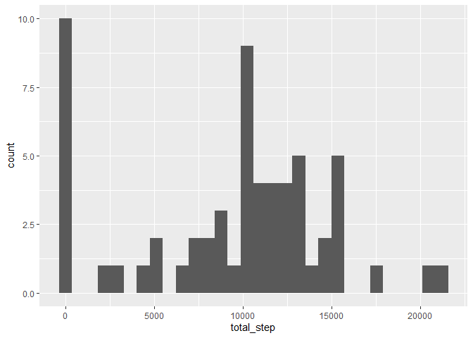
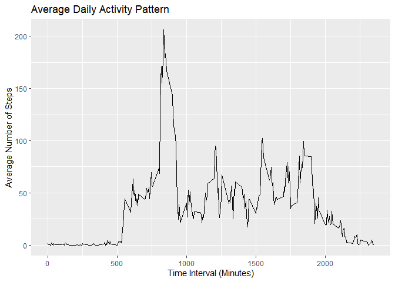
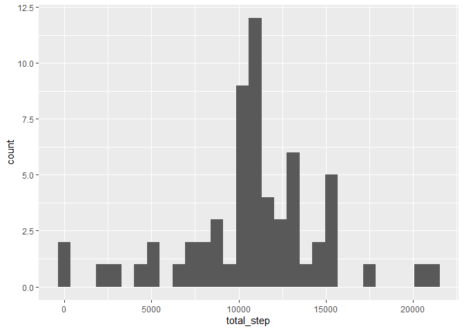
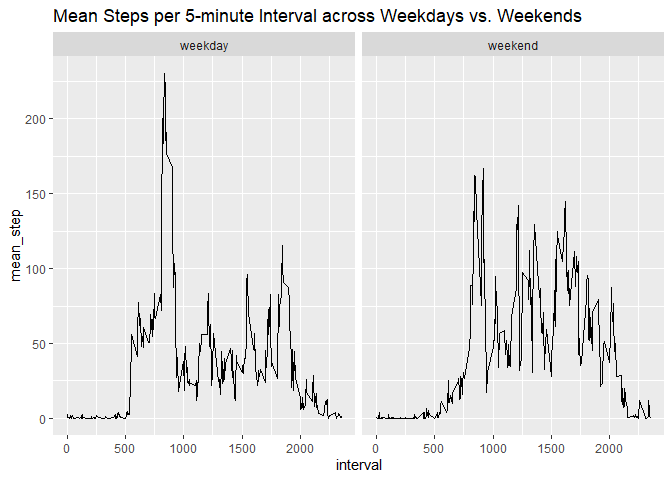

Reproducible Course Project 1
================
Haiying Yuan
12/16/2020

Introduction

This assignment makes use of data from a personal activity monitoring
device. This device collects data at 5 minute intervals through out the
day. The data consists of two months of data from an anonymous
individual collected during the months of October and November, 2012 and
include the number of steps taken in 5 minute intervals each day.

This assignment are organized in the following five sections to meet the
project requirements and anwer the four questions. 1. Loading and
preporocessing the data 2. what is mean total number of steps taken per
day? 3. what is the average daily activity pattern? 4. Imputing missing
values 5. Are there differences in activity patterns between weekdays
and weekends?

# 1.Loading and preprocessing the data

``` r
# setup workspace

rm(list=ls())
graphics.off()

library(ggplot2)
library(dplyr)
repdata<-read.csv("activity.csv")
```

# 2\. What is mean total number of steps taken per day?

``` r
total_steps_data<-repdata%>%group_by(date)%>%summarise(total_step=sum(steps,na.rm = TRUE))
```

    ## `summarise()` ungrouping output (override with `.groups` argument)

``` r
# This is the histogram of the total number of steps taken each day
ggplot(total_steps_data,aes(total_step))+geom_histogram()
```

    ## `stat_bin()` using `bins = 30`. Pick better value with `binwidth`.

<!-- -->

``` r
# This is the mean of total number of steps taken per day
mean_steps_data<-mean(total_steps_data$total_step)
mean_steps_data
```

    ## [1] 9354.23

``` r
#This is the median of total number of steps taken per day
median_steps_data<-median(total_steps_data$total_step)
median_steps_data
```

    ## [1] 10395

# 3.What is the average daily activity pattern?

``` r
time_series_data<-repdata%>%group_by(interval)%>%summarise(mean_step=mean(steps,na.rm = TRUE))
```

    ## `summarise()` ungrouping output (override with `.groups` argument)

``` r
ggplot(time_series_data,aes(x=interval,y=mean_step))+geom_line()+ggtitle("Average Daily Activity Pattern")+xlab("Time Interval (Minutes)")+ylab("Average Number of Steps")
```

<!-- -->

``` r
# The 5-minute interval that, on average, contains the maximum number of steps is: 
time_series_data[which.max(time_series_data$mean_step),]$interval
```

    ## [1] 835

# 4\. Imputing missing values

``` r
## Calculate and report the total number of missing values in the dataset 
total_missing_step<-sum(is.na(repdata$steps))

#Create a new dataset that is equal to the original dataset but with the missing data filled in by using the mean for that 5-minute interval. 
mean_per_interval<-repdata%>%group_by(interval)%>%summarise(mean_step=mean(steps,na.rm = TRUE))
```

    ## `summarise()` ungrouping output (override with `.groups` argument)

``` r
repdata_imputed<-repdata%>%mutate(steps=case_when(is.na(steps)~mean_per_interval$mean_step[match(repdata$interval,mean_per_interval$interval)], TRUE~as.numeric(steps)))

# Make a histogram of the total number of steps taken each day and Calculate and report the mean and median total number of steps taken per day. Do these values differ from the estimates from the first part of the assignment? What is the impact of imputing missing data on the estimates of the total daily number of steps?


total_steps_imputed<-repdata_imputed%>%group_by(date)%>%summarise(total_step=sum(steps,na.rm = TRUE))
```

    ## `summarise()` ungrouping output (override with `.groups` argument)

``` r
ggplot(total_steps_imputed,aes(total_step))+geom_histogram()
```

    ## `stat_bin()` using `bins = 30`. Pick better value with `binwidth`.

<!-- -->

``` r
# This is the mean number of steps taken per day after imputing missing values
mean_steps_imputed<-mean(total_steps_imputed$total_step)
mean_steps_imputed
```

    ## [1] 10766.19

``` r
#This is the median number of steps taken per day after imputing missing values
median_steps_imputed<-median(total_steps_imputed$total_step)
median_steps_imputed
```

    ## [1] 10766.19

``` r
#In conclusion, the mean and median of the total steps per day after imputation differ from the estimates from the first part of the assignment.  
```

# 5\. Are there differences in activity patterns between weekdays and weekends?

``` r
# Panel plot comparing the average number of steps taken per 5-minute interval across weekdays and weekends

repdata_imputed$date<-as.Date(repdata_imputed$date)
repdata_imputed_week<-repdata_imputed%>%mutate(day_week=weekdays(date))%>%mutate(weekday_end=ifelse(day_week=="Saturday"|day_week=="Sunday", "weekend","weekday"))

repdata_imputed_week_mean<-repdata_imputed_week%>%group_by(weekday_end,interval)%>%summarise(mean_step=mean(steps))
```

    ## `summarise()` regrouping output by 'weekday_end' (override with `.groups` argument)

``` r
ggplot(repdata_imputed_week_mean,aes(x=interval,y=mean_step))+geom_line()+facet_wrap(~weekday_end)+ggtitle ("Mean Steps per 5-minute Interval across Weekdays vs. Weekends")
```

<!-- -->
